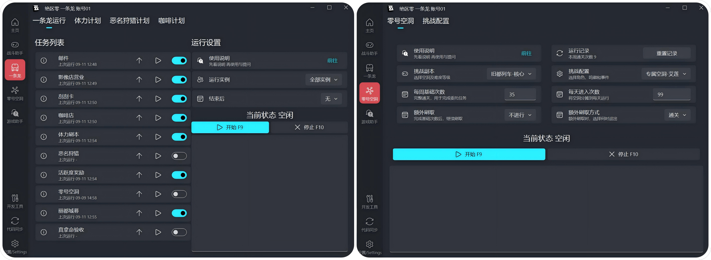

<!-- markdownlint-restore -->

# ZenlessZoneZero - OneDragon

**绝区零 - 一条龙**

    
    

    
    

 

基于 绝区零 && 图像识别 && 一条龙框架，适用于 PC 端，一键完成日常任务

（无修改游戏、读取内存等行为，低调学习的好学生应该不会被米哈游老师抓）

如果喜欢本项目，可右上角送作者一个`Star` ✨

[主页](https://one-dragon.org/zzz/zh/home.html) & 唯一指定 QQ 群 `861603314`

 
<!-- markdownlint-restore -->

## 支持功能

- **战斗：** 一键自动战斗
- **闪避：** 支持声音、图像识别
- **日常：** 影像店、刮刮乐、咖啡店、刷本等全日常
- **空洞：** 自动空洞

## 图片展示

## 常见问题

### **如遇问题请先阅读以下文档！⚠️**

### [常见问题](https://one-dragon.org/zzz/zh/quickstart.html "安装失败先看这里！")

## 免责声明

- 本项目仅供学习交流使用。

- 开发者团队拥有本项目的最终解释权。

- 使用本项目产生的所有问题与本项目与及开发者团队无关。

- 若您遇到商家使用本软件进行代练并收费，产生的任何问题及后果与本软件无关。

## 贡献/参与者

感谢所有参与到开发的朋友们~

## 赞助

如果喜欢本项目，可以为作者的赞助一点服务器维护费用~

感谢 [小伙伴们的支持](https://github.com/DoctorReid/OneDragon-Thanks)

