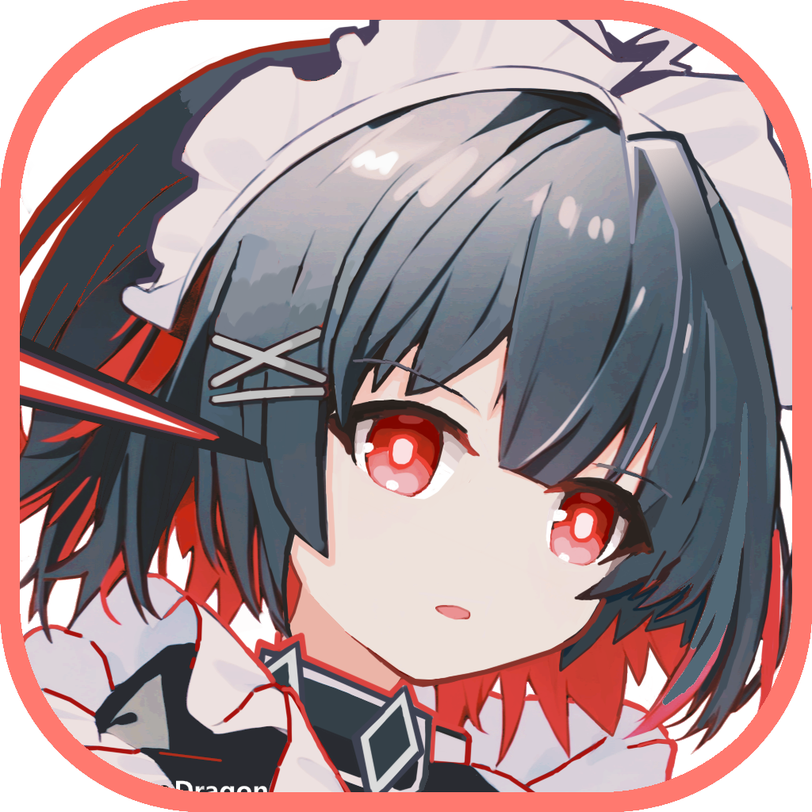

<!-- markdownlint-restore -->

# ZenlessZoneZero - OneDragon

**绝区零 - 一条龙**

    
    

    
    

 

基于 绝区零 && 图像识别 && 一条龙框架，适用于 PC 端，一键完成日常任务

（无修改游戏、读取内存等行为，低调学习的好学生应该不会被米哈游老师抓）

如果喜欢本项目，可右上角送作者一个`Star` ✨

❤ [ [官方网站](https://one-dragon.org/zzz/zh/home.html) ] & [ 唯一指定 QQ 群 `861603314` ] ❤

 
<!-- markdownlint-restore -->

## 支持功能

- **自动战斗：** 支持自定义逻辑、技能标记、条件、变量等进阶用法
- **闪避助手：** 基于声音、图像一体化识别，轻占用，高准确
- **日常清理：** 影像店、刮刮乐、咖啡店、材料、奖励等全日常清理
- **自动空洞：** 基于大模型训练的识别、事件、寻路的功能模块
- **更多功能：** 拿命验收、空洞业绩、定时启动、多账号切换……

## 图片展示

## 快速开始

[快速开始](https://one-dragon.org/zzz/zh/quickstart.html)

## 免责声明

- 本项目仅供学习交流使用。

- 开发者团队拥有本项目的最终解释权。

- 使用本项目产生的所有问题与本项目与及开发者团队无关。

- 若您遇到商家使用本软件进行代练并收费，产生的任何问题及后果与本软件无关。

- 本软件 logo 由 [巡夜子](https://github.com/yokuminto) 绘制，巡夜子及软件全体开发者保留所有权利。不得在未经授权的情况下使用本软件 logo，或将其用于任何用途。

## 贡献/参与者

感谢所有参与到开发的朋友们~

## 赞助

如果喜欢本项目，可以为作者的赞助一点服务器维护费用~

感谢 [小伙伴们的支持](https://github.com/DoctorReid/OneDragon-Thanks)

