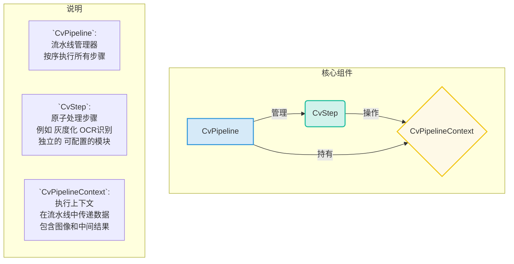

# 架构指南：可动态配置的计算机视觉(CV)流水线

## 1. 摘要与设计目标

本文档旨在阐述项目当前计算机视觉（CV）核心模块的架构设计。该架构的核心是一个高度可扩展、可动态配置的**CV处理流水线（CV Pipeline）**。

设计该系统的主要目标是：

*   **解耦核心逻辑与UI**：将底层的CV算法与上层的图形界面（Qt）彻底分离，使得CV逻辑可以被独立测试、复用和演进。
*   **流程可视化与快速调试**：提供一个可视化的开发工具，允许开发者通过拖拽和配置，快速搭建、调试和验证图像处理流程。
*   **动态参数化**：允许在流水线的任何步骤中，动态地、精细化地调整CV算法（特别是OCR）的每一个参数，以应对不同场景，最大化识别准确率和性能。
*   **代码生成与复用**：将调试好的流水线流程一键生成为可直接在生产环境中调用的Python代码，极大提高开发效率。

## 2. 核心概念与组件

系统的核心由三个主要类构成，它们共同协作，构成了整个CV流水线的基础。



### 2.1. `CvStep` (处理步骤)

-   **定义**：一个独立的、原子的图像处理操作单元。所有步骤都继承自 `one_dragon.base.cv_process.cv_step.CvStep`。
-   **可配置性**：通过重写 `get_params()` 方法，一个`CvStep`可以向UI暴露任意数量的参数。系统会根据定义的类型（如`bool`, `int`, `float`, `enum`）自动生成对应的UI控件（复选框、滑块、下拉菜单等），并附带标签和工具提示。
-   **执行逻辑**：每个步骤的核心逻辑在 `_execute()` 方法中实现，它接收 `CvPipelineContext` 作为输入，并对其进行修改。

### 2.2. `CvPipeline` (流水线)

-   **定义**：`CvStep`的有序集合。它负责创建`CvPipelineContext`，并按顺序依次调用每个步骤的`execute`方法，将上下文在步骤间传递。

### 2.3. `CvPipelineContext` (上下文)

-   **定义**：一个数据容器，贯穿整个流水线的生命周期。它携带了`display_image`（当前用于处理和显示的图像）、`mask_image`（二值化掩码）、`contours`（轮廓列表）以及`ocr_result`等关键数据。

## 3. 核心服务与UI逻辑

### 3.1. `CvService` (后端服务)

-   **定位**: `src/one_dragon/base/cv_process/cv_service.py`
-   **职责**:
    -   负责加载和保存在 `assets/image_analysis_pipelines/` 目录下的 `.yml` 流水线配置文件。
    -   作为在生产环境中**运行这些流水线的统一入口**。业务代码（如 `TargetStateChecker`）通过调用 `cv_service.run_pipeline('your_pipeline_name', image)` 来执行一个完整的CV任务。
    -   维护一个可用`CvStep`的注册表，供UI和加载器使用。

### 3.2. 图像分析工具 (前端逻辑)

-   **定位**: `src/one_dragon_qt/view/devtools/devtools_image_analysis_interface.py` (UI界面) 和 `src/one_dragon_qt/logic/image_analysis_logic.py` (UI逻辑)
-   **职责**:
    -   提供一个完整的图形化界面，允许开发者加载本地图片。
    -   通过组合、排序、配置不同的`CvStep`来搭建流水线。
    -   实时预览每一步CV处理的结果。
    -   将调试好的流水线保存为 `.yml` 文件，供`CvService`在生产环境中使用。

## 4. 开发者指南：创建、调试与集成CV流水线

### 4.1. 可视化开发工作流 (如何使用)

1.  **Step 1: 打开图像分析工具**: 在开发工具中，通过“打开图片”按钮加载一张用于调试的目标截图。
2.  **Step 2: 搭建与配置流水线**: 从界面左侧的“添加步骤”下拉框中选择您需要的CV步骤（如“HSV范围过滤”），它将被添加到流水线列表中。您可以通过拖拽或使用上下箭头调整步骤的执行顺序。
3.  **Step 3: 调试与分析结果**: 选中流水线中的任意一个步骤，其所有可配置参数会立即显示在下方。实时调整参数（例如，拖动二值化的阈值滑块），主界面上的图像会**即时更新**，直观地展示出参数变化带来的效果。同时，右下角的文本框会显示该步骤的日志输出（如找到的轮廓数量、OCR识别的文本和置信度）和性能耗时。
4.  **Step 4: 保存流水线**: 当流水线调试到最佳效果时，在顶部的输入框中为其命名，并点击“保存”或“另存为”按钮。您的流水线将被保存为一个 `.yml` 文件，存放在 `assets/image_analysis_pipelines/` 目录下。
5.  **Step 5: 在代码中调用**: 在您的业务代码中（例如 `TargetStateChecker`），通过 `cv_service.run_pipeline('your_pipeline_name', image)` 来调用刚刚保存的流水线，完成一次完整的CV识别。

### 4.2. 如何扩展：创建全新的`CvStep`

本节将通过一个完整的示例，指导您如何创建一个名为**“提取红色通道”**的全新CV处理步骤。

*   **Step 1: 继承`CvStep`基类**
    *   在 `one_dragon/base/cv_process/cv_step.py` 中，添加以下类定义：

    ```python
    class CvStepExtractRedChannel(CvStep):
        def __init__(self):
            super().__init__('提取红色通道')
    ```

*   **Step 2: 实现`_execute`方法**
    *   在 `CvStepExtractRedChannel` 类中，添加核心处理逻辑。红色通道是RGB图像的第一个通道（索引为0）。

    ```python
    def _execute(self, ctx: CvPipelineContext) -> bool:
        # 我们的流水线约定使用RGB图像
        # 红色通道是第一个通道
        red_channel = ctx.display_image[:, :, 0]
        
        # 创建一个与原图大小相同的黑色图像
        h, w = red_channel.shape
        new_image = np.zeros((h, w, 3), dtype=np.uint8)
        
        # 将红色通道的数据赋给新图像的红色通道
        new_image[:, :, 0] = red_channel
        
        # 更新上下文中的图像用于显示
        ctx.display_image = new_image
        
        ctx.add_log_entry(f"已提取红色通道")
        return True
    ```

*   **Step 3: 暴露参数 `get_params` (可选)**
    *   这个简单的步骤不需要参数，所以我们可以让 `get_params` 返回一个空字典。

    ```python
    def get_params(self) -> dict:
        return {} # 本步骤无需配置参数
    ```

*   **Step 4: 在`CvService`中注册**
    *   打开 `one_dragon/base/cv_process/cv_service.py`。
    *   首先，从 `cv_step` 模块中导入我们新创建的类。

    ```python
    from one_dragon.base.cv_process.cv_step import (
        ..., CvStepExtractRedChannel # <-- 新增
    )
    ```
    *   然后，在 `CvService` 的 `__init__` 方法中，将其添加到 `self.available_steps` 字典里。

    ```python
    self.available_steps: Dict[str, Type[CvStep]] = {
        '提取红色通道': CvStepExtractRedChannel, # <-- 新增
        '按模板裁剪': CvStepCropByTemplate,
        '灰度化': CvStepGrayscale,
        # ... 其他步骤
    }
    ```

*   **Step 5: 重启与验证**
    *   完成以上代码修改后，重新启动程序。
    *   打开“图像分析工具”，您现在应该可以在“添加步骤”的下拉菜单中找到并使用“提取红色通道”这个新功能了。

### 4.3. 关键设计解析 (最佳实践)

*   **统一的RGB颜色空间**: 这是保证所有CV流程正确工作的基石。
    *   **约定**: `CvService`及其所有流水线都假定处理的是**RGB图像**。
    *   **实践**:
        *   从实时截图获取的图像，应确保为RGB格式。
        *   通过 `cv2.imread` 加载的离线图片，**必须**在加载后立即使用 `cv2.cvtColor(img, cv2.COLOR_BGR2RGB)` 进行转换，然后再传递给`CvService`。

*   **OCR模块的完全参数化 (`CvStepOcr`)**:
    *   **背景**: `OnnxOcrMatcher` 具有大量影响性能和准确率的参数。
    *   **实现**: `CvStepOcr` 步骤将这些参数暴露给了UI。当执行时，它会使用这些UI上的参数临时覆盖OCR引擎的全局设置。
    *   **优势**: 这使得我们可以为特定场景（如识别截图中的倾斜文字）临时启用`use_angle_cls`，或在需要高性能时开启`use_gpu`，而无需修改任何代码。这些设置仅对当前流水线生效，不会污染全局OCR配置。