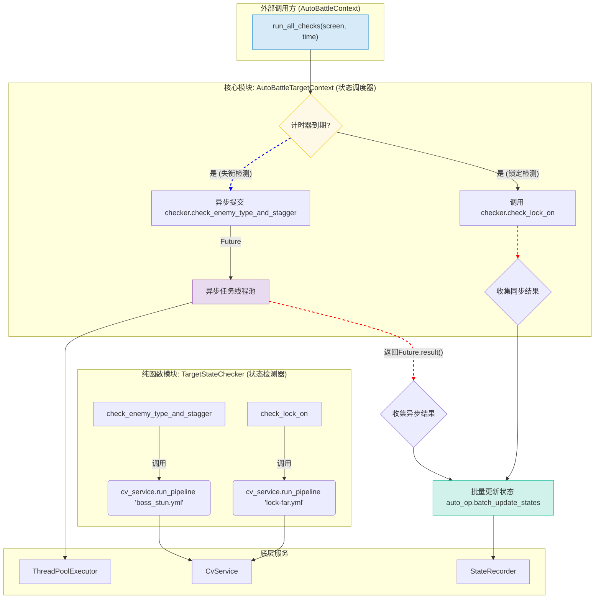

# 架构指南：敌对目标状态检测模块 (`TargetState`)

## 1. 摘要与设计目标

### 1.1. 问题陈述

在《绝区零》等高速动作游戏中，战局瞬息万变。为了实现高效、智能的自动化战斗，程序必须能够实时、准确地获取敌方目标的多个关键状态，例如：

*   **锁定状态**: 我方是否已锁定目标？距离多远？
*   **敌人类型**: 当前目标是普通小怪还是需要优先处理的强敌（Boss）？
*   **失衡状态**: 强敌的失衡值还剩多少？
*   **异常状态**: 目标是否正处于燃烧、冰冻、侵蚀等异常状态下？

这些状态的检测涉及到不同类型的计算机视觉（CV）技术（模板匹配、OCR等），它们的计算开销和要求更新的频率也各不相同，这给实时处理带来了巨大挑战。

### 1.2. 设计目标

本模块旨在构建一个高性能、高内聚、可扩展的敌对目标状态检测系统，其核心设计目标如下：

*   **高性能**: 将高频、快速的CV检测（如锁定状态，通常为ms级）与低频、慢速的OCR检测（如识别失衡值，可能为几十ms级）在执行上分离，避免慢速任务阻塞关键的战斗决策循环。
*   **高内聚**: 将所有与“目标状态”相关的逻辑（计时、调度、检测、更新）封装在一个独立的、自洽的模块中，与角色状态、闪避状态等其他战斗逻辑完全解耦。
*   **可扩展性**: 提供清晰、简单的扩展路径，方便未来添加新的敌方状态检测（例如，特殊护盾、特定buff、弱点暴露等），而无需对现有核心逻辑进行伤筋动骨的修改。
*   **动态频率**: 允许系统根据战斗的实时上下文，动态调整不同检测任务的执行频率。例如，在未锁定敌人时高频索敌，在成功锁定后则降低频率，从而在保证关键状态（如“是否锁定”）即时性的同时，最大限度地节约CPU资源。

## 2. 核心概念与组件

本模块的架构核心在于**职责分离**：将“何时检测”（调度逻辑）与“如何检测”（具体CV算法）彻底分开。这通过两个核心类实现：`AutoBattleTargetContext` 和 `TargetStateChecker`。



### 2.1. `AutoBattleTargetContext` (状态调度器)

-   **定位**: `src/zzz_od/auto_battle/auto_battle_target_context.py`
-   **职责**: 模块的“大脑”，负责**调度**。
    -   **管理多重计时器**: 为不同类型的检测任务（锁定、失衡、异常）维护独立的计时器和时间间隔。
    -   **动态调整频率**: 根据检测结果动态调整下一次的检测间隔（详见3.2节）。
    -   **提交异步任务**: 将耗时的OCR任务提交到私有的`ThreadPoolExecutor`中执行。
    -   **收集并批量更新**: 收集所有同步和异步任务的结果，并统一、批量地更新到`StateRecorder`，减少状态更新的次数。

### 2.2. `TargetStateChecker` (状态检测器)

-   **定位**: `src/zzz_od/auto_battle/target_state/target_state_checker.py`
-   **职责**: 模块的“工具箱”，负责**执行**。
    -   **纯粹性**: 这是一个无状态的类，不包含任何计时器或调度逻辑。
    -   **封装CV调用**: 其内部封装了对`CvService`和具体`.yml`流水线的调用。
    -   **提供高级接口**: 向`AutoBattleTargetContext`提供清晰的高级检测接口，如`check_lock_on()`、`check_enemy_type_and_stagger()`等。

## 3. 功能亮点与工作流程

### 3.1. 混合并发模型：同步CV与异步OCR

这是本模块高性能设计的基石。我们深刻认识到，不同的CV任务性能差异巨大，将它们混合同步执行是不可接受的。

-   **同步部分 (即时响应)**: 像“锁定状态检测”这类基于模板匹配的、计算开销极小的CV任务，会在`run_all_checks`被调用时**立即同步执行**。这确保了对“是否锁定”这类关键状态的判断几乎没有延迟。

-   **异步部分 (后台处理)**: 像“失衡值识别”、“异常状态识别”这类依赖OCR、计算开销较大的任务，则会被**异步提交**到一个独立的`ThreadPoolExecutor`。这意味着主战斗循环不会因为等待OCR结果而被阻塞，从而保证了操作的流畅性。`run_all_checks`方法会在最后尝试获取这些异步任务的结果，如果任务尚未完成，则会等到下一帧再处理。

### 3.2. 动态频率调度

为了在确保精度的同时节约系统资源，模块引入了动态间隔机制。以锁定检测为例：

1.  **初始化**: 模块维护两个间隔值：`_lock_check_interval_unlocked` (例如0.1秒) 和 `_lock_check_interval_locked` (例如1.0秒)。
2.  **未锁定时**: 当前检测间隔`_current_lock_check_interval`默认为`_lock_check_interval_unlocked`。这使得系统会以**每秒10次**的高频率检查锁定状态，以确保能快速捕捉到锁定敌人的瞬间。
3.  **锁定后**: 一旦`check_lock_on()`返回了`目标-近距离锁定`的状态，`AutoBattleTargetContext`会**立即**将`_current_lock_check_interval`切换为`_lock_check_interval_locked`。
4.  **效果**: 在成功锁定敌人后，检测频率**降低到每秒1次**。这极大地减少了不必要的CV计算，因为在已锁定的情况下，我们只需要偶尔确认一下目标没有丢失即可。

这个简单的机制体现了智能化的资源管理思想，将CPU周期用在最需要的地方。

### 3.3. 统一的颜色空间（RGB）

在开发过程中，我们发现并修复了一个关于颜色空间的底层问题，并以此为契机建立了一套严格的约定。

-   **核心问题**: 上游的截图器直接产生RGB格式的图像，但`CvService`曾错误地将其作为BGR图像再次转换为RGB，导致传入流水线的图像颜色通道颠倒，使依赖精确颜色的HSV过滤（如失衡数字的橙色）失效。
-   **最终约定**:
    1.  `CvService`的`run_pipeline`方法不再进行任何颜色转换，它假定所有传入的图像**必须是RGB格式**。
    2.  所有调用`CvService`的地方（无论是实时战斗还是离线分析工具），都有责任确保传入的是RGB图像。
        -   对于实时截图，通常直接就是RGB。
        -   对于通过`cv2.imread`加载的离线图片，**必须**在加载后立即使用`cv2.cvtColor(img, cv2.COLOR_BGR2RGB)`进行转换。

这一约定保证了所有CV流水线（`.yml`文件）的作者都可以放心地在RGB颜色空间下配置参数，确保了线上与线下调试结果的完全一致。

## 4. 架构优势总结

-   **高性能与高响应性**: 通过混合并发模型，确保了关键决策的即时性，同时避免了慢速任务对系统的拖累。
-   **高度解耦与内聚**: 调度逻辑与执行逻辑的分离，使得模块内部职责清晰，易于理解和维护。
-   **卓越的可扩展性**: 提供了一套清晰、模式化的流程来添加新的状态检测，极大地降低了二次开发的门槛。
-   **智能化资源管理**: 动态频率调度机制，使得系统能够根据战况自适应地调整资源开销，在效果和性能之间取得了良好的平衡。

---
*下一部分将提供详细的开发者指南*
## 5. 开发者指南：使用、维护与扩展

本章节是为需要使用、修改或扩展此模块的开发者准备的实践指南。

### 5.1. 如何使用

在战斗AI中正确使用本模块非常简单，遵循以下步骤即可。

1.  **初始化**: 在 `AutoBattleOperator` 的 `init_before_running` 方法中，当您初始化 `AutoBattleContext` 时，通过关键字参数传入本模块所需的检测频率。
    ```python
    # in AutoBattleOperator.init_before_running()
    
    self.auto_battle_context.init_battle_context(
        # ... other params
        check_stagger_interval=self.get('check_stagger_interval', 0.5), # 失衡检测频率
        check_abnormal_interval=self.get('check_abnormal_interval', 1.0), # 异常状态检测频率
        check_lock_interval_locked=self.get('check_lock_interval_locked', 1.0), # 锁定后检测频率
        check_lock_interval_unlocked=self.get('check_lock_interval_unlocked', 0.1) # 未锁定时检测频率
    )
    ```

2.  **调用**: 在主战斗循环（通常是 `AutoBattleContext.check_battle_state`）中，确保 `self.target_context.run_all_checks` 被调用。这是本模块的**唯一入口点**。
    ```python
    # in AutoBattleContext.check_battle_state()
    
    if in_battle:
        # ...
        future_list.append(_battle_state_check_executor.submit(self.target_context.run_all_checks, screen, screenshot_time))
        # ...
    ```

3.  **获取状态**: 在您的战斗决策逻辑中（通常是 `.yml` 格式的操作序列文件），直接通过 `when` 或 `until` 字段来订阅和使用本模块产生的状态。
    ```yaml
    # in your_op.yml
    
    - op: 释放终结技
      when:
        - 目标-失衡值 <= 20  # 当失衡值低于20时
        - 目标-近距离锁定   # 并且目标已被锁定时
    ```

### 5.2. 如何维护

1.  **调试技巧**:
    *   **日志定位**: 本模块的所有关键日志都以 `[失衡检测-调试]` 作为前缀。当出现问题时，可以优先关注这些日志，它们会显示任务的触发、参数的传递以及最终的返回结果。
    *   **CV流程调试**: 如果怀疑是某个具体的CV算法（如颜色过滤）出了问题，请使用项目提供的“图像分析工具”。通过该工具加载 `assets/image_analysis_pipelines/` 目录下对应的 `.yml` 文件（如 `boss_stun.yml`），并使用一张游戏截图，即可离线、可视化地调试每一步CV处理的效果。

2.  **修改现有检测**:
    *   **调整检测逻辑**: 如果您想优化“失衡值”的识别算法（例如，更换一种更强的颜色过滤参数），您**只需要修改 `assets/image_analysis_pipelines/boss_stun.yml` 文件**，而完全不需要触碰任何Python代码。这是本架构的核心优势之一。
    *   **调整检测频率**: 如果您觉得当前的检测频率过高或过低，只需要回到 `AutoBattleOperator` 的初始化部分，调整传递给 `init_battle_context` 的 `interval` 参数值即可。

### 5.3. 如何添加新的状态检测

本节将通过一个完整的案例，展示如何为系统添加一个全新的**“敌人护盾”**状态检测。

#### Step 1: 创建CV流水线 (如果需要)

如果新的检测需要复杂的CV处理（而不仅仅是模板匹配），请先使用“图像分析工具”创建一个新的CV流水线。

1.  打开工具，加载一张敌人带有护盾的截图。
2.  通过组合不同的CV步骤（如“按模板裁剪”、“HSV范围过滤”等），搭建一个能够稳定识别出护盾的流程。
3.  将这个流水线另存为 `enemy_shield.yml`，并确保它位于 `assets/image_analysis_pipelines/` 目录下。

#### Step 2: 在`TargetStateChecker`中添加新方法

打开 `src/zzz_od/auto_battle/target_state/target_state_checker.py`，添加一个新方法。

```python
# in TargetStateChecker

def check_enemy_shield(self, screen: MatLike) -> List[Tuple[str, Any]]:
    """
    检测敌人是否持有特殊护盾。
    :return: [('目标-有护盾', True)] 或 []
    """
    result = self._run_pipeline('enemy_shield', screen)
    if result is not None and result.is_success:
        # 这里的逻辑取决于你的 a_is_success 是如何定义的
        # 可能是找到了轮廓，也可能是OCR识别到了特定文字
        return [('目标-有护盾', True)]
    else:
        return []
```

#### Step 3: 在`AutoBattleTargetContext`中添加新的调度逻辑

打开 `src/zzz_od/auto_battle/auto_battle_target_context.py`。

1.  **添加新的计时器变量**:
    ```python
    # in AutoBattleTargetContext.__init__()

    self._shield_check_interval: float = 0.5
    self._shield_last_check_time: float = 0
    ```

2.  **在`init_battle_target_context`中接收新参数**:
    ```python
    # in AutoBattleTargetContext.init_battle_target_context()
    
    def init_battle_target_context(self,
                                 ...,
                                 check_shield_interval: float = 0.5, # 新增
                                 **kwargs):
        # ...
        self._shield_check_interval = check_shield_interval # 新增
        # ...
    ```

3.  **在`run_all_checks`中添加调度代码**:
    根据新检测的性能，决定是同步还是异步执行。假设护盾检测是一个快速的CV任务，我们采用同步执行。

    ```python
    # in AutoBattleTargetContext.run_all_checks()

    # ...
    # 1. 同步执行快速的CV任务
    if now - self._lock_last_check_time >= self._current_lock_check_interval:
        # ... (原有的锁定检测)
    
    # 新增护盾检测
    if now - self._shield_last_check_time >= self._shield_check_interval:
        self._shield_last_check_time = now
        shield_results = self.checker.check_enemy_shield(screen)
        self._add_records_from_results(records_to_update, shield_results, screenshot_time)

    # 2. 异步提交耗时的OCR任务
    # ...
    ```

#### Step 4: 在`AutoBattleOperator`中传递新参数

打开 `src/zzz_od/auto_battle/auto_battle_operator.py`，找到对 `init_battle_context` 的调用，并传入新的时间间隔参数。

```python
# in AutoBattleOperator.init_before_running()

self.auto_battle_context.init_battle_context(
    # ...
    check_shield_interval=self.get('check_shield_interval', 0.5) # 新增
)
```

#### Step 5: 在`StateRecorder`中注册新状态

最后，为了让新的状态能被决策系统识别，需要将其添加到有效的状态列表中。

打开 `src/zzz_od/auto_battle/auto_battle_operator.py`，找到 `get_all_state_event_ids` 方法。

```python
# in AutoBattleOperator.get_all_state_event_ids()

# ...
# 2.2 对于值在上下文中语义唯一的，省略分类名
event_ids.append('目标-有护盾') # 新增
for _, display_name in EnemyTypeValue.get_display_map().items():
# ...
```

至此，一个新的状态检测已完全集成到系统中。