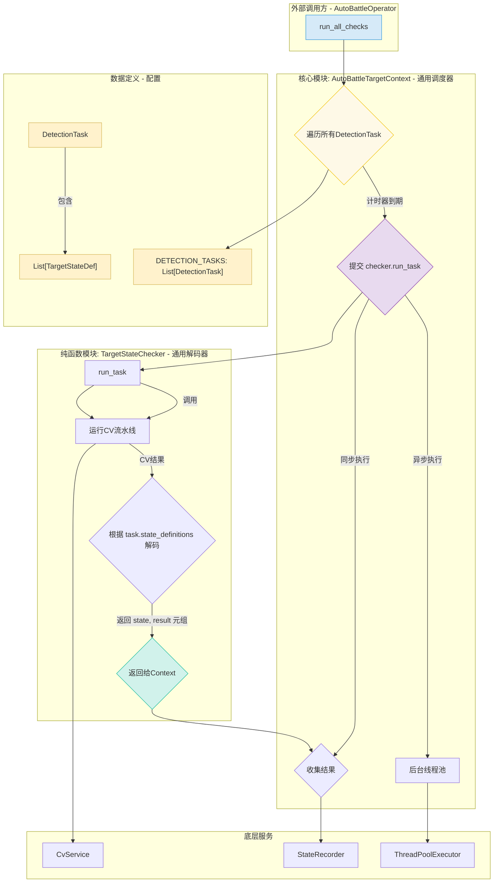

# 架构指南：敌对目标状态检测模块 (数据驱动版)

## 1. 摘要与设计目标

### 1.1. 问题陈述

在《绝区零》等高速动作游戏中，为了实现高效、智能的自动化战斗，程序必须能够实时、准确地获取敌方目标的多个关键状态，例如：

*   **锁定状态**: 我方是否已锁定目标？
*   **敌人类型**: 当前目标是普通小怪还是强敌？
*   **失衡状态**: 强敌的失衡值还剩多少？
*   **异常状态**: 目标是否处于燃烧、冰冻等状态下？

这些状态的检测涉及到不同类型的计算机视觉（CV）技术，它们的计算开销和更新频率也各不相同。

### 1.2. 设计目标

本模块旨在构建一个**高性能、可扩展、数据驱动**的敌对目标状态检测系统。

*   **高性能**: 将高频、快速的CV检测（如锁定）与低频、慢速的OCR检测（如失衡值）在执行上分离，避免慢速任务阻塞关键决策。
*   **可扩展性 (核心)**: **通过修改纯数据文件，而非Python逻辑代码，即可添加新的状态检测。** 这是本架构最重要的设计目标。
*   **动态频率**: 允许系统根据战斗上下文，动态调整检测频率，节约CPU资源。
*   **状态自动管理**: 状态不仅能被检测和更新，还能在消失时被自动清除，确保状态的准确性。

## 2. 核心概念与组件 (数据驱动架构)

本模块的核心在于**数据驱动**和**职责分离**。所有的检测任务都由数据结构（`DetectionTask`, `TargetStateDef`）来定义，由两个核心类来执行。



### 2.1. 核心数据结构 (驱动核心)

-   **定位**: `src/zzz_od/game_data/target_state.py`

#### `TargetStateDef`
定义了**一个**具体的状态如何被检测。
-   `state_name`: 状态的唯一名称，如 `目标-强敌`。
-   `check_way`: 使用哪种方法来解读CV结果，例如 `TargetCheckWay.CONTOUR_COUNT_IN_RANGE`。
-   `check_params`: `check_way` 所需的参数，例如 `{'min_count': 1}`。
-   `clear_on_miss`: **一个关键布尔值。如果为 `True`，当该状态未被检测到时，系统会主动清除它；如果为 `False`，则忽略。**

#### `DetectionTask`
将共享同一个CV流水线的一组状态定义打包在一起。
-   `task_id`: 任务的唯一ID，如 `boss_status`。
-   `pipeline_name`: 需要运行的CV流水线名称，如 `boss_stun`。
-   `state_definitions`: 一个 `TargetStateDef` 的列表，所有这些状态都将从同一个CV结果中被解码。
-   `enabled`: **(新增)** 一个布尔值，默认为 `True`。如果设为 `False`，此任务将被完全忽略，方便调试。
-   `interval`: 任务的默认执行间隔（秒）。
-   `is_async`: 是否异步执行。

### 2.2. `AutoBattleTargetContext` (通用调度器)

-   **定位**: `src/zzz_od/auto_battle/auto_battle_target_context.py`
-   **职责**:
    -   **加载数据**: 从 `game_data` 加载所有 `DetectionTask`，并**过滤掉 `enabled` 为 `False` 的任务**。
    -   **调度执行**: 根据每个任务的 `interval` 计时，到期后调用 `TargetStateChecker.run_task`。
    -   **结果处理**: 接收 `checker` 返回的结果，并根据结果创建 `StateRecord`（包括更新、赋值、清除）。

### 2.3. `TargetStateChecker` (通用解码器)

-   **定位**: `src/zzz_od/auto_battle/target_state/target_state_checker.py`
-   **职责**:
    -   **运行CV**: 根据传入的 `DetectionTask`，调用相应的CV流水线。
    -   **解码结果**: 遍历 `task` 中的每个 `TargetStateDef`，使用指定的 `check_way` 和 `check_params` 来解码CV结果。
    -   **返回约定**: 对每个状态，返回一个标准化的结果，通知 `Context` 如何操作。

#### 返回值与CheckWay约定

`TargetStateChecker` 的 `_check_...` 方法的返回值是驱动状态更新的核心。

| 返回值                 | 含义                             | 生成的 `StateRecord`                          |
| ---------------------- | -------------------------------- | --------------------------------------------- |
| `True`                 | 状态被检测到，只需更新时间戳     | `StateRecord(state_name, time)`               |
| `(True, value)`        | 状态被检测到，且需要更新一个新值 | `StateRecord(state_name, time, value=value)`  |
| `None`                 | 状态未被检测到，且需要**清除**   | `StateRecord(state_name, is_clear=True)`      |
| `False`                | 状态未被检测到，需要**忽略**     | *不生成任何记录*                              |

**这个约定，结合 `TargetStateDef` 中的 `clear_on_miss` 参数，提供了对状态生命周期管理的精确控制。**

#### 特殊 `check_way` 说明：`MAP_CONTOUR_LENGTH_TO_PERCENT`

这是一个特殊且强大的 `check_way`，用于将一个进度条（如血条、失衡条）的长度转换为0-100的百分比。

-   **工作原理**: 它计算 **轮廓的外接矩形宽度** 与 **遮罩图像的宽度** 的比值。
-   **CV流水线要求**: 使用此 `check_way` 的CV流水线，必须能输出两个关键结果到 `CvPipelineContext` 中：
    1.  `contours`: 通过颜色过滤等方式找到的、代表当前进度条值的轮廓。
    2.  `mask_image`: 一个二值图，其**宽度**代表了进度条100%时的总长度。通常这个 `mask_image` 是通过裁剪(Crop)操作得到的。
-   **示例**: `boss_stun_line.yml` 流水线先裁剪出失衡条区域，然后通过HSV过滤颜色得到轮廓和遮罩，最后由该方法计算出失衡值的精确百分比。

## 3. 开发者指南：使用与扩展

### 3.1. 如何使用

使用方法与旧版一致。在 `.yml` 决策文件中，通过 `when` 或 `until` 字段订阅本模块产生的状态即可。

```yaml
# in your_op.yml
- op: 释放终结技
  when:
    - 目标-失衡值 <= 20
    - 目标-近距离锁定
```

### 3.2. 如何扩展 (核心优势)

得益于数据驱动的架构，添加一个新的状态检测**极其简单**，**通常只需要修改一个文件**。

#### 案例：添加一个新的“敌人护盾”状态检测

##### Step 1: 准备CV流水线 (如果需要)

如果检测逻辑复杂，先在 `assets/image_analysis_pipelines/` 目录下创建一个新的 `enemy_shield.yml` 文件。如果只是简单的模板匹配，可以复用现有的流水线。

##### Step 2: 在数据定义中添加新状态

打开 **唯一需要修改的文件**: `src/zzz_od/game_data/target_state.py`。

假设我们希望这个“护盾”状态与“强敌”、“失衡值”使用同一个CV流水线 `boss_stun` 进行检测。我们只需在对应的 `DetectionTask` 中添加一个新的 `TargetStateDef` 即可。

```python
# in src/zzz_od/game_data/target_state.py

# ... (省略其他定义)

DETECTION_TASKS = [
    DetectionTask(
        task_id='boss_status',
        pipeline_name='boss_stun', # 复用已有的流水线
        enabled=True, # (新增) 方便地启用或禁用此任务
        interval=0.5,
        is_async=True,
        state_definitions=[
            TargetStateDef(
                state_name='目标-强敌',
                check_way=TargetCheckWay.OCR_TEXT_CONTAINS,
                check_params={'contains': '强敌'},
                clear_on_miss=True
            ),
            # === 新增的护盾状态定义 ===
            TargetStateDef(
                state_name='目标-有护盾',
                # 假设护盾检测是通过检查轮廓数量实现的
                check_way=TargetCheckWay.CONTOUR_COUNT_IN_RANGE, 
                check_params={'min_count': 1},
                # 当护盾消失时，也清除这个状态
                clear_on_miss=True 
            )
            # ========================
        ]
    ),
    # ... (其他任务)
]
```

**完成了。**

你不需要修改 `TargetStateChecker` 或 `AutoBattleTargetContext`。系统会自动加载这个新的定义。如果想临时禁用某个任务，只需将其 `enabled` 标志设为 `False`。

### 3.3. 如何维护

1.  **调试CV问题**: 如果怀疑是CV算法（如颜色过滤）出了问题，使用“图像分析工具”加载对应的 `.yml` 文件（如 `boss_stun_line.yml`），并使用游戏截图进行离线调试。
2.  **调整检测频率 (默认关闭，显式激活)**: 本模块采用“默认关闭，显式激活”的设计模式，以提供最大的灵活性和性能控制。

    *   **核心理念**: 一个检测任务 (`DetectionTask`) 默认是**不运行**的，即使它的 `enabled` 标志为 `True`。它必须被用户的配置文件**显式激活**。

    *   **如何激活和配置 (推荐)**:
        在你的战斗配置文件（如 `config/auto_battle/.test.yml`）中，为需要启用的任务设置一个**大于0**的检测间隔。
        ```yaml
        # in your_battle_config.yml
        
        # 设置为 0.2 秒检测一次，激活“目标锁定”任务
        target_lock_interval: 0.2
        
        # 设置为 1.0 秒检测一次，激活“异常状态”任务
        abnormal_status_interval: 1.0
        
        # 如果不写某一项，或者其值为0或负数，则对应的任务不会运行
        ```
        这是**唯一推荐**的、用于配置和激活这些可选任务的方式。

    *   **代码中的默认值 (`target_state.py`)**:
        在 `src/zzz_od/game_data/target_state.py` 文件中，可配置任务（如 `lock_on`）的默认 `interval` 被设置为 `0`。
        -   这个 `0` 值意味着任务处于“可用但休眠”状态。
        -   它**不会**被执行，直到被 `.yml` 文件中的一个正数间隔所覆盖。

## 4. 架构优势总结

-   **卓越的可扩展性**: 添加新状态检测的成本从“修改多个Python类”降低到“在数据文件中添加一个条目”，极大地提升了开发效率和系统的可维护性。
-   **高度解耦与内聚**: 调度逻辑（`Context`）、解码逻辑（`Checker`）和任务定义（`Data`）完全分离，职责清晰。
-   **精确的状态管理**: 通过 `clear_on_miss` 和标准化的返回值约定，开发者可以精确控制每个状态的生命周期。
-   **高性能**: 保留了原有的混合并发模型，确保关键决策的即时性。